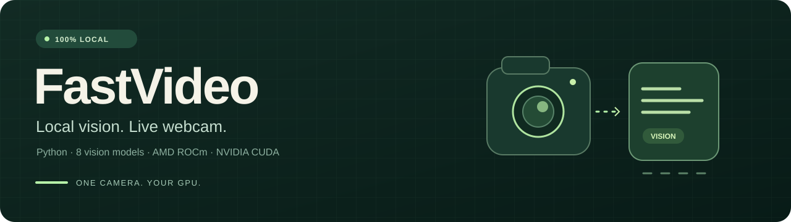
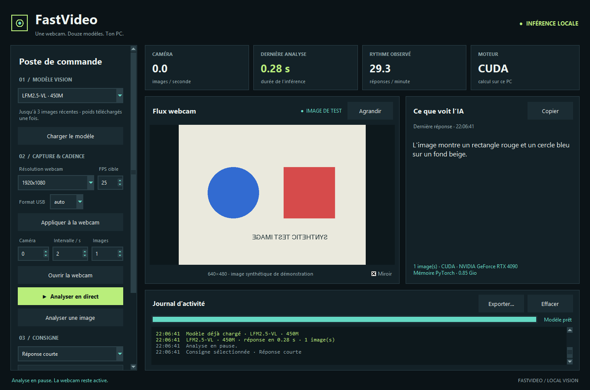

<p align="center">
  
</p>

<p align="center">
  <a href="https://github.com/lfpoulain/fastvideo/actions/workflows/ci.yml"></a>
  <a href="https://www.python.org/downloads/"></a>
  <a href="LICENSE"></a>
  
</p>

# FastVideo

**Ta webcam, douze modèles vision et une fenêtre Python.**

FastVideo affiche la webcam en continu et décrit ce qu'elle voit avec un modèle exécuté
sur ton PC. Choisis le modèle dans le menu, adapte la consigne et compare les résultats.
L'app utilise Tkinter, OpenCV et PyTorch, avec détection automatique de **CUDA, ROCm ou CPU**.

**[Installation](docs/installation.md) · [Utilisation](docs/usage.md) · [Architecture](docs/architecture.md) · [Validation](docs/validation.md) · [Contribuer](CONTRIBUTING.md)**

## Ce que tu peux faire

- Afficher une webcam et obtenir des descriptions actualisées en français.
- Choisir la capture HD / Full HD / 4K et les FPS (1080p à 25 FPS par défaut), avec aperçu agrandi.
- Passer de SmolVLM2 à Qwen, MiniCPM, LFM, FastVLM ou Moondream dans la même fenêtre.
- Modifier la consigne et la fréquence des analyses, puis mettre l'IA en pause.
- Comparer jusqu'à trois images récentes pour observer les changements visibles.
- Analyser une image locale depuis le terminal et afficher le temps d'inférence.
- Utiliser les modèles déjà téléchargés en mode hors ligne, avec `--offline`.
- Précharger un modèle, analyser une seule image et copier la dernière description.
- Suivre le téléchargement, les FPS, les temps de réponse et la mémoire GPU.
- Consulter et exporter le journal d'activité ; les logs sont aussi conservés sur disque.

L'interface sombre regroupe les réglages à gauche, la webcam et la réponse au centre,
et le journal en dessous. Les indicateurs distinguent la fluidité de la caméra
de la cadence des analyses. Voir [les boutons et les métriques](docs/usage.md#boutons-et-réglages).



*Capture de la fenêtre sur une image synthétique, analysée par LFM 450M sur RTX 4090.
Les FPS de caméra sont à zéro dans cette démonstration sans flux physique.*

Les images sont traitées en mémoire sur le PC. Aucune clé API ni serveur à lancer.
Les poids sont téléchargés depuis les dépôts officiels au premier usage de chaque modèle.

## Démarrage rapide

Après le clone, un seul script prépare Python **3.12**, crée `.venv`, installe PyTorch
pour **AMD ROCm, NVIDIA CUDA ou CPU**, vérifie les dépendances puis ouvre l'app.
Sous Windows, **double-clique sur `start.cmd`** pour lancer la préparation et l'app.
Chaque lancement écrit automatiquement **`logs/startup-latest.log`**, y compris les erreurs
avant l'ouverture de l'interface. PowerShell attend Entrée après une erreur dans
une console interactive ; `start.cmd` attend une touche. Les anciens journaux sont
conservés avec une date. Voir le [dépannage du lancement](docs/installation.md#si-la-fenêtre-se-ferme-trop-vite).
Aux lancements suivants, il réutilise l'environnement. Les pilotes GPU doivent être
installés sur le PC ; voir les [prérequis AMD / NVIDIA](docs/installation.md).

<details open>
<summary><strong>Windows · PowerShell</strong></summary>

```powershell
git clone https://github.com/lfpoulain/fastvideo.git
cd fastvideo
powershell -NoProfile -ExecutionPolicy Bypass -File .\setup.ps1
```

</details>

<details>
<summary><strong>Linux · Terminal</strong></summary>

```bash
git clone https://github.com/lfpoulain/fastvideo.git
cd fastvideo
bash setup.sh
```

Le script choisit un Python 3.12 avec Tkinter ou en télécharge un dans `.tools/`.
Une session graphique et les bibliothèques système restent nécessaires sous Linux.

</details>

Dans la fenêtre : **choisir un modèle → ouvrir la webcam → analyser en direct**.

La détection AMD couvre les **HX370 / HX375 / HX470 / HX475 (`gfx1150`)** et
les **Ryzen AI Max 385 / 395 (`gfx1151`)**, en privilégiant le GPU détecté.
Pour imposer un profil, exemple Ryzen AI Max 385 :

```powershell
powershell -NoProfile -ExecutionPolicy Bypass -File .\setup.ps1 -Backend rocm -AmdArch gfx1151
```

```bash
bash setup.sh --backend rocm --amd-arch gfx1151
```

Les poids sont téléchargés au premier usage du modèle choisi. Tu peux préparer le
PC sans ouvrir l'app avec `-SetupOnly` / `--setup-only`, ou inspecter l'installation
avec `-DryRun` / `--dry-run`. Voir [les options des scripts](docs/installation.md#installation-automatique).

## Les douze modèles

| Modèle | Identifiant `--model` | Dépôt officiel |
| --- | --- | --- |
| **SmolVLM2 500M** · sélection par défaut | `smol` | [HuggingFaceTB](https://huggingface.co/HuggingFaceTB/SmolVLM2-500M-Video-Instruct) |
| **Qwen3.5 0,8B** | `qwen-0.8b` | [Qwen](https://huggingface.co/Qwen/Qwen3.5-0.8B) |
| **Qwen3.5 2B** | `qwen-2b` | [Qwen](https://huggingface.co/Qwen/Qwen3.5-2B) |
| **Qwen3.5 4B** | `qwen-4b` | [Qwen](https://huggingface.co/Qwen/Qwen3.5-4B) |
| **MiniCPM-V 4.6** | `minicpm` | [OpenBMB](https://huggingface.co/openbmb/MiniCPM-V-4.6) |
| **LFM2.5-VL 450M** | `lfm-450m` | [Liquid AI](https://huggingface.co/LiquidAI/LFM2.5-VL-450M) |
| **LFM2.5-VL 1,6B** | `lfm-1.6b` | [Liquid AI](https://huggingface.co/LiquidAI/LFM2.5-VL-1.6B) |
| **LFM2.5-VL 3B** | `lfm-3b` | [Liquid AI](https://huggingface.co/LiquidAI/LFM2.5-VL-3B) |
| **FastVLM 0,5B** | `fastvlm` | [Apple](https://huggingface.co/apple/FastVLM-0.5B) |
| **FastVLM 1,5B** | `fastvlm-1.5b` | [Apple](https://huggingface.co/apple/FastVLM-1.5B) |
| **FastVLM 7B** | `fastvlm-7b` | [Apple](https://huggingface.co/apple/FastVLM-7B) |
| **Moondream3 Preview** · 9B totaux / 2B actifs | `moondream3` | [Moondream](https://huggingface.co/moondream/moondream3-preview) |

Les révisions sont fixées dans [`vision.py`](vision.py). Les huit premiers modèles utilisent
les architectures natives de Transformers. FastVLM et Moondream utilisent le code officiel,
chargé à une révision précise, et analysent la dernière image. Moondream utilise son API
`query`, sans raisonnement, avec le chemin SDPA pour fonctionner sans compilation Triton.
Son tokenizer séparé est également fixé et mis en cache pour le mode hors ligne.

Les grands modèles demandent plus de mémoire : les poids non quantifiés de FastVLM 7B
occupent environ **15,5 Go**, ceux de Moondream3 environ **18,5 Go**, avant les caches et
le travail d'inférence. Les 2B actifs de Moondream ne réduisent pas la taille des 9B de poids.
Sur Ryzen, vérifie la mémoire réellement accessible à l'iGPU. Voir la [validation](docs/validation.md).

## Quelques commandes

```powershell
# LFM 450M, réponses courtes et intervalle de 0,5 seconde
.\.venv\Scripts\python.exe app.py --model lfm-450m --interval 0.5 --max-tokens 60

# Exiger l'accélération AMD ROCm
.\.venv\Scripts\python.exe app.py --device rocm

# Essayer l'attention ROCm expérimentale sur Radeon
.\.venv\Scripts\python.exe app.py --device rocm --model lfm-3b --rocm-experimental-attention

# Comparer trois images récentes
.\.venv\Scripts\python.exe app.py --frames 3

# Analyser une image locale
.\.venv\Scripts\python.exe app.py --model qwen-2b --image photo.jpg
```

Voir [toutes les options et le dépannage](docs/usage.md).

## Pensé pour une webcam

La capture, l'interface et l'inférence tournent séparément. L'app utilise les images
les plus récentes, limite à 640 × 480 les images envoyées au modèle et ne lance
qu'une analyse à la fois. L'aperçu conserve la résolution de capture choisie.
Un seul modèle est chargé ; sa mémoire est libérée avant de passer au suivant.
Le mode ROCm utilise FP16 et l'attention SDPA de PyTorch.
L'option `--rocm-experimental-attention` autorise les kernels AMD expérimentaux
au lancement ; la case **Attention ROCm expérimentale** permet aussi de le choisir
dans l'interface avant le premier chargement. PyTorch sélectionne ensuite un kernel
compatible. Le réglage est verrouillé pour la session après le début du chargement.
Le journal indique
la version de PyTorch, HIP, l'architecture AMD et le mode autorisé. Le gain dépend
du GPU et du modèle ; cette option ne fournit pas les kernels `causal_conv1d` de LFM.

La vidéo reste continue et les descriptions arrivent à la vitesse du modèle.
L'intervalle est le délai minimum entre les départs de deux analyses.

**Validation actuelle :** les douze modèles ont généré des réponses sur une RTX 4090
en BF16 et FP16. Les quatre nouvelles entrées ont aussi été vérifiées hors ligne.
La vraie webcam, la pause et le changement de modèle ont été testés sur le catalogue initial ;
le menu étendu propose bien les douze choix. Voir les [mesures et le protocole](docs/validation.md).
Les performances sur matériel AMD restent à mesurer.

## Licence

Le code de l'application est sous [licence MIT](LICENSE). Les poids et le code fourni
par les dépôts des modèles conservent leurs licences respectives, indiquées sur leurs
pages officielles. Les poids et les images de webcam ne sont pas inclus dans ce dépôt.
Moondream3 Preview possède une [licence BSL 1.1 avec clause additionnelle](https://huggingface.co/moondream/moondream3-preview/blob/5112966d1a723413b1c9a1e8bea272b72e647b35/LICENSE.md).
