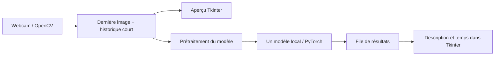

# Architecture

[← Retour au README](../README.md)

Le code de l'app est réparti en quatre fichiers Python :

| Fichier | Responsabilité |
| --- | --- |
| [`app.py`](../app.py) | Capture OpenCV, boutons, planification, métriques et journal. |
| [`interface.py`](../interface.py) | Mise en page et styles Tkinter / ttk. |
| [`downloads.py`](../downloads.py) | Préparation des fichiers utiles et progression Hugging Face. |
| [`vision.py`](../vision.py) | Catalogue, choix CUDA/ROCm/CPU, chargement et génération. |

## Flux d'une analyse

La capture tourne dans un thread dédié. L'interface consulte la dernière image
et reçoit les résultats par une file. La génération s'exécute dans un autre thread.
Les widgets sont modifiés uniquement depuis le thread Tkinter.
Le worker envoie également les étapes du chargement et la progression du transfert
dans cette file. Les mises à jour de téléchargement sont limitées à cinq par seconde.

## Images et cadence

La capture demande par défaut 1920 × 1080 à 25 images/s ; résolution, cadence et
format USB sont réglables. Le pilote peut choisir un autre mode : la taille de
la première image reçue et les propriétés annoncées sont remontées à l'interface.
La dernière image est conservée en pleine résolution pour les aperçus principal
et agrandi. Seuls les snapshots destinés au modèle et les échantillons historiques
sont réduits à 640×480 au maximum, en conservant leurs proportions.
L'affichage peut être en miroir ; l'inférence reçoit l'orientation originale.

L'historique contient au maximum trois échantillons. Une analyse utilise la dernière
image et, si demandé, jusqu'à deux images plus anciennes. Les échantillons expirent
après quatre secondes. Une nouvelle génération ne démarre que lorsque la précédente
est terminée : la cadence s'adapte au modèle et au matériel.
Après un chargement lent, le worker reprend une image fraîche avant de générer
la première réponse. Les FPS sont calculés sur les timestamps de capture ; la
cadence des réponses utilise une fenêtre des trente dernières réponses.

## Téléchargement et journal

L'interface prépare les fichiers avec `snapshot_download` et un `tqdm_class`
personnalisé pour transmettre les octets à Tkinter. L'index safetensors détermine
les shards exacts : les variantes ONNX, FP8 et les anciens poids ne sont pas
préchargés. Le total correspond aux fichiers manquants ; chaque révision reste fixée.
Le mode hors ligne passe directement au cache sans requête de métadonnées.
Le CLI sans interface conserve le chargement direct par Transformers.

Le journal visible est borné. `RotatingFileHandler` conserve trois fichiers de
2 Mio au maximum, et le journal peut être exporté depuis la fenêtre. Les réponses
et les images ne sont pas enregistrées automatiquement.

## Changer ou arrêter le modèle

Un événement d'annulation est testé pendant la génération. Chaque session possède
un identifiant ; les réponses tardives d'une ancienne session sont ignorées.
Lors d'un changement, l'ancien modèle est libéré et le cache GPU est vidé avant
le chargement du suivant. Un chargement initial se termine avant que l'annulation
ne soit traitée.

## Moteur d'inférence

- CUDA : BF16 si pris en charge, sinon FP16.
- ROCm : FP16, via l'API `torch.cuda` de PyTorch HIP.
- CPU : FP32.

Les modèles natifs utilisent `AutoModelForImageTextToText`, `AutoProcessor` et
l'attention SDPA. Le raisonnement est désactivé quand le template le permet.
MiniCPM utilise une seule vue et le downsampling `16x` pour limiter les tokens visuels.

FastVLM utilise `AutoModelForCausalLM` avec l'architecture du dépôt officiel Apple.
Son adaptateur insère le token image `-200`, applique le prétraitement du vision tower
et décode la génération. La révision du code et des poids est fixée dans le catalogue.

Moondream3 charge sa classe officielle `HfMoondream`. Son tokenizer séparé est
téléchargé à une révision fixée dans le même cache, puis fourni au constructeur
pour éviter son téléchargement implicite sur `main`. Le modèle utilise son chemin
SDPA (`use_flex_decoding=False`), sans compilation ni dépendance à Triton.
L'adaptateur appelle `query` sur la dernière image avec `reasoning=False` et
`temperature=0`, recueille le flux et le ferme lors de l'annulation.
Les crops BF16 du prétraitement officiel sont convertis vers la précision des
poids pour conserver le chemin FP16 sur ROCm et FP32 sur CPU.

L'app ne sauvegarde pas les images de webcam. Les fichiers des modèles restent dans
`models/`. L'option `--offline` désactive les téléchargements pour le chargement.
