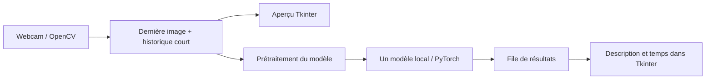

# Architecture

[← Retour au README](../README.md)

Le code de l'app tient dans deux fichiers :

| Fichier | Responsabilité |
| --- | --- |
| [`app.py`](../app.py) | Fenêtre Tkinter, capture OpenCV, boutons et planification des analyses. |
| [`vision.py`](../vision.py) | Catalogue, choix CUDA/ROCm/CPU, chargement et génération. |

## Flux d'une analyse

La capture tourne dans un thread dédié. L'interface consulte la dernière image
et reçoit les résultats par une file. La génération s'exécute dans un autre thread.
Les widgets sont modifiés uniquement depuis le thread Tkinter.

## Images et cadence

La capture demande 640 × 480 à 30 images/s. Si la caméra fournit une résolution
supérieure, les images sont réduites en conservant leurs proportions.
L'aperçu est affiché en miroir ; l'inférence reçoit l'image dans son orientation originale.

L'historique contient au maximum trois échantillons. Une analyse utilise la dernière
image et, si demandé, jusqu'à deux images plus anciennes. Les échantillons expirent
après quatre secondes. Une nouvelle génération ne démarre que lorsque la précédente
est terminée : la cadence s'adapte au modèle et au matériel.

## Changer ou arrêter le modèle

Un événement d'annulation est testé pendant la génération. Chaque session possède
un identifiant ; les réponses tardives d'une ancienne session sont ignorées.
Lors d'un changement, l'ancien modèle est libéré et le cache GPU est vidé avant
le chargement du suivant. Un chargement initial se termine avant que l'annulation
ne soit traitée.

## Moteur d'inférence

- CUDA : BF16 si pris en charge, sinon FP16.
- ROCm : FP16, via l'API `torch.cuda` de PyTorch HIP.
- CPU : FP32.

Les modèles natifs utilisent `AutoModelForImageTextToText`, `AutoProcessor` et
l'attention SDPA. Le raisonnement est désactivé quand le template le permet.
MiniCPM utilise une seule vue et le downsampling `16x` pour limiter les tokens visuels.

FastVLM utilise `AutoModelForCausalLM` avec l'architecture du dépôt officiel Apple.
Son adaptateur insère le token image `-200`, applique le prétraitement du vision tower
et décode la génération. La révision du code et des poids est fixée dans le catalogue.

L'app ne sauvegarde pas les images de webcam. Les fichiers des modèles restent dans
`models/`. L'option `--offline` désactive les téléchargements pour le chargement.
